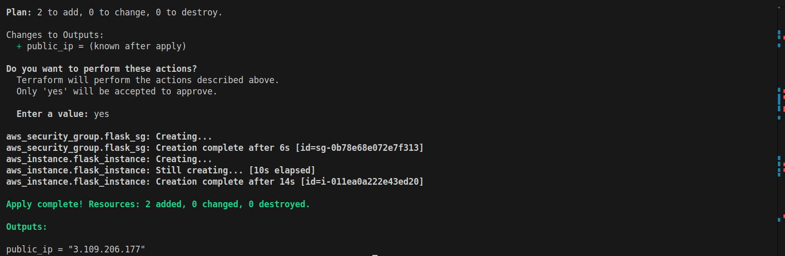
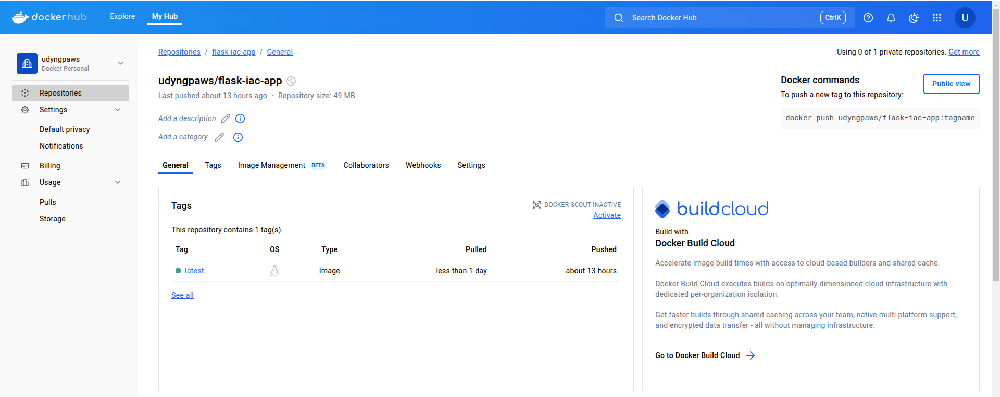
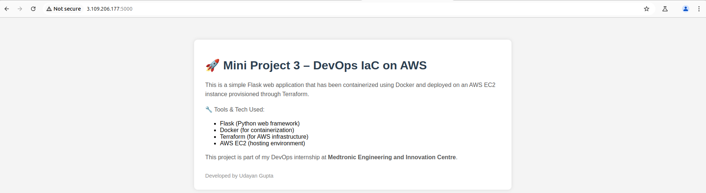

# 🚀 Mini Project 3: DevOps IaC on AWS using Terraform & Docker

This mini project demonstrates how to automate cloud infrastructure provisioning and deploy a containerized Flask application on AWS using **Infrastructure as Code (IaC)** with **Terraform** and **Docker**.

It is part of my DevOps internship at **Medtronic Engineering and Innovation Centre**, under the Shared Services/DevOps team.

---

## 📌 Project Overview

This project showcases:

- A **Flask-based Python web application**
- **Docker** to containerize the app
- **Terraform** to provision an EC2 instance on AWS
- **EC2** to host and run the container
- All steps automated using a startup script passed during provisioning

---

## 🧱 Tech Stack

| Tool/Service | Purpose                        |
| ------------ | ------------------------------ |
| Flask        | Python micro web framework     |
| Docker       | Containerization of the app    |
| Terraform    | IaC for AWS provisioning       |
| AWS EC2      | Cloud instance to host the app |

---

## 🗂️ Project Structure

```
mini-project-iac-aws/
├── app/
│   ├── app.py              # Flask app with homepage
│   ├── requirements.txt    # Python dependencies
│   └── Dockerfile          # Docker image definition
├── terraform/
│   ├── main.tf             # AWS provider and EC2 configuration
│   ├── variables.tf        # Input variables (if used)
│   ├── outputs.tf          # Output values
│   ├── provider.tf         # AWS provider config
│   └── deploy.sh           # User data script for EC2 startup
├── setup.sh                # Shell script to run Terraform using .env
├── .env                    # Stores AWS credentials locally (excluded from git)
└── README.md               # Project documentation
```

---

## 🌐 Flask App Homepage

This app simply displays a styled homepage that summarizes:

- Tools & Technologies used
- Project intent and learning goals
- Branding for internship

✅ Minimal and clean for demonstration.

---

## ⚙️ How Terraform Works

1. `terraform init` initializes the provider
2. `terraform plan` shows the execution plan
3. `terraform apply` provisions the infrastructure:
   - Creates an EC2 instance
   - Adds a security group for port 5000
   - Runs the `deploy.sh` script on startup to:
     - Install Docker
     - Pull the image from Docker Hub
     - Run the container on port 5000

---

## 🐳 Docker Image

Image Name: `udyngpaws/flask-iac-app:latest`  
Docker Hub: [https://hub.docker.com/r/udyngpaws/flask-iac-app](https://hub.docker.com/r/udyngpaws/flask-iac-app)

---

## 🚀 Running the Project (Locally with Minikube)

You can test locally using Docker:

```bash
# Build the image
docker build -t flask-iac-app ./app

# Run the app
docker run -p 5000:5000 flask-iac-app

# Visit
http://localhost:5000
```

---

## 📷 Project Screenshots

### ✅ Terraform Apply Output



### ✅ Docker Hub Image



### ✅ EC2 Instance Running


### ✅ Flask App in Browser



---

## 📌 Notes

- `deploy.sh` runs automatically on EC2 boot to configure the server
- Ensure AWS credentials are provided via a `.env` file (not hardcoded)
- A helper script `setup.sh` is included to simplify deployment
- The `venv/`, `.terraform/`, `.env`, and other local files are ignored using `.gitignore`

---

### 🛠️ `setup.sh` Script

This script helps you:

- Load AWS credentials from your `.env` file
- Navigate to the `terraform/` folder
- Initialize and apply your Terraform configuration

#### 📄 Sample `.env`

```env
AWS_ACCESS_KEY_ID=your-access-key-id
AWS_SECRET_ACCESS_KEY=your-secret-access-key
```

> ⚠️ Make sure `.env` is included in `.gitignore` to prevent accidental commits.

#### 🧪 Run the script

```bash
chmod +x setup.sh
./setup.sh
```

#### 📜 `setup.sh`

```bash
#!/bin/bash

echo "🔐 Loading environment variables from .env..."
if [ -f .env ]; then
    export $(grep -v '^#' .env | xargs)
    echo "✅ Environment variables loaded."
else
    echo "❌ .env file not found! Please create it first."
    exit 1
fi

echo "🚀 Moving into terraform directory..."
cd terraform || { echo "❌ terraform/ directory not found"; exit 1; }

echo "🧱 Running terraform init..."
terraform init

echo "🛠️ Running terraform apply..."
terraform apply
```

---

## 🙌 Acknowledgements

Special thanks to Podili Sravan Kumar, Manikanta Nandyala, Aravind Ramini and my manager Kesari Suresh from the I&O team at **Medtronic Engineering and Innovation Centre** for their invaluable guidance and support throughout this project.

---

## ✍️ Author

**Udayan Gupta**  
DevOps Intern  
Medtronic Engineering and Innovation Centre, Hyderabad
